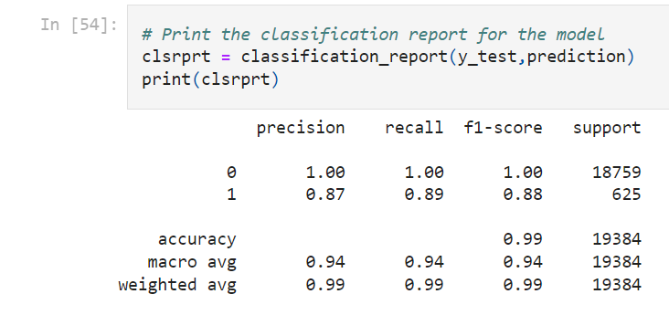

## Overview
This project aims to build a credit risk classification model using a dataset of historical lending activity from a peer-to-peer lending services company. The objective is to create a model that can accurately identify the creditworthiness of borrowers, distinguishing between healthy loans and high-risk loans.

## Steps Taken

1. **Repository Setup**
   - Created a new repository called "credit-risk-classification" specifically for this project.
   - Cloned the repository to the local computer.

2. **Data Preparation**
   - Read the "lending_data.csv" data file from the Resources folder into a Pandas DataFrame.
   - Created the labels set (y) from the "loan_status" column, indicating 0 for healthy loans and 1 for high-risk loans.
   - Created the features DataFrame (X) from the remaining columns.
   - Split the data into training and testing datasets using the train_test_split function.

3. **Logistic Regression Model**
   - Developed a logistic regression model using the training data (X_train and y_train).
   - Applied the fitted model to make predictions for the testing data labels using X_test.

4. **Model Evaluation**
   - Evaluated the performance of the logistic regression model by performing the following steps:
     - Generated a confusion matrix to analyze true positives, true negatives, false positives, and false negatives.
     - Printed the classification report, including accuracy, precision, recall, and F1-score metrics.
     - Analyzed the model's ability to predict both healthy loans (0 labels) and high-risk loans (1 labels).

5. **Credit Risk Analysis Report**

   - Included a summary and analysis of the machine learning model's performance.
   - Described the accuracy score, precision score, and recall score using a bulleted list.
   - Provided a summary of the results and justified the recommendation for using the model by the company or provided reasoning if not recommending the model.

## Conclusion
This credit risk classification project involved building a logistic regression model to identify the creditworthiness of borrowers using historical lending data. The project followed a step-by-step approach to split the data, train the model, evaluate its performance, and provide a credit risk analysis report. The model's performance metrics, including accuracy, precision, and recall, were analyzed and presented in the report, enabling a justified recommendation for the model's use or reasoning.
